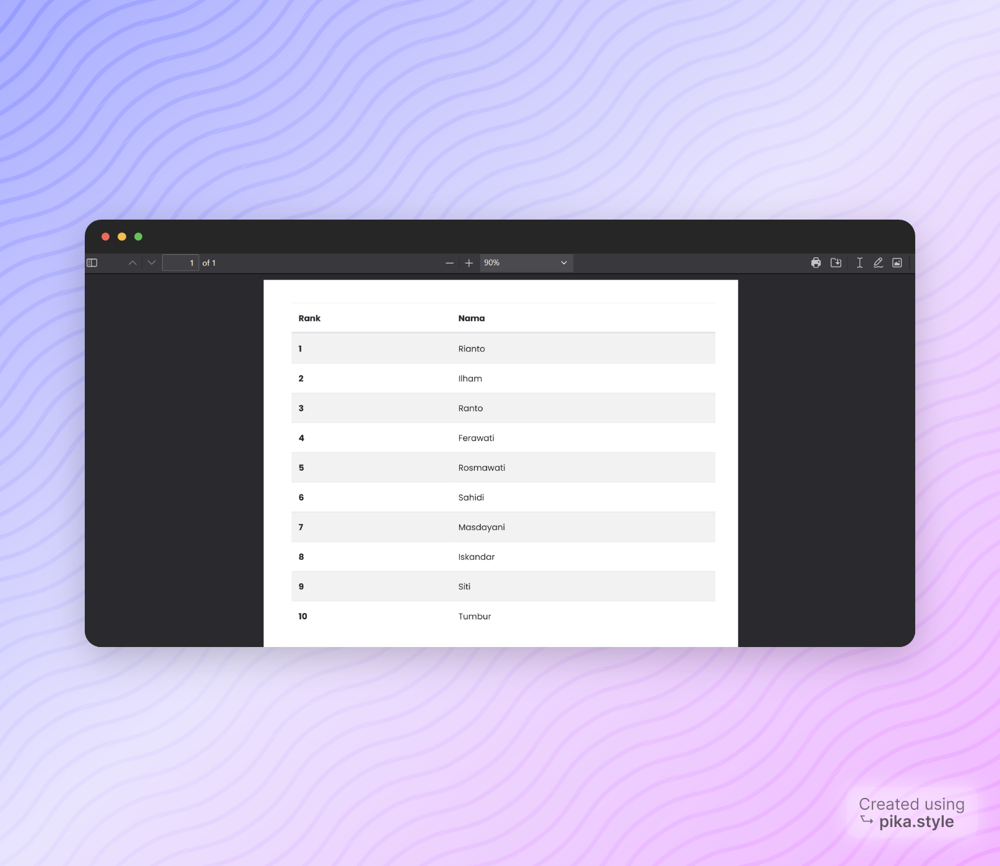

# Sistem Pendukung Keputusan Pegawai Terbaik

Proyek dari kelompok 4 ini merupakan implementasi sistem pembantu keputusan (Decision Support System - DSS) berbasis web yang dikembangkan menggunakan framework Laravel dan ditata dengan desain responsif menggunakan Bootstrap. Sistem ini dirancang untuk membantu proses penentuan pegawai terbaik dalam suatu organisasi

## Anggota

**Fitrah Rahmadhani** 2141762092

**Halim Teguh** 2141762122

**Muhammad Ilham Maulidin** 2141762087

**Nabila Rasyidah** 2141762047

## Tech Stack

**Front End:** HTML, CSS, Bootstrap, Jquery

**Back End:** Laravel

## Screenshots




## Instalasi DB

Buat database MySql di phpmyadmin seperti dibawah ini


## Instalasi

Instalasi projek

```bash
  composer install
  cp .env.example .env
  php artisan key:generate
  php artisan migrate:fresh --seed
  php artisan db:seed
```
